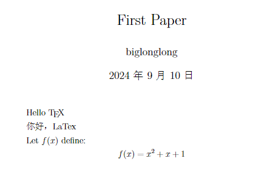
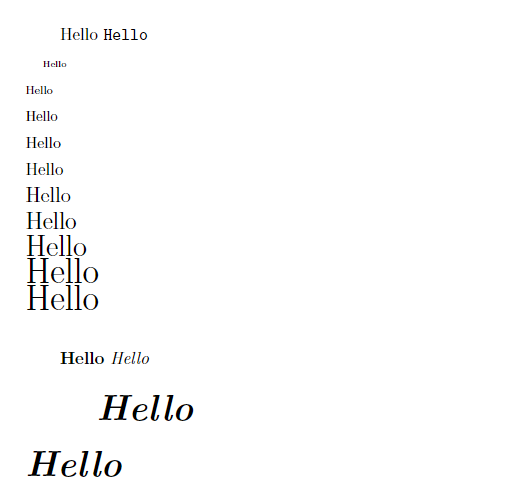
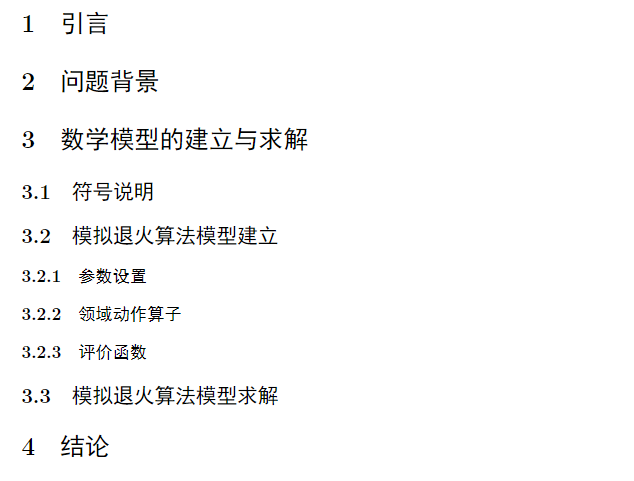
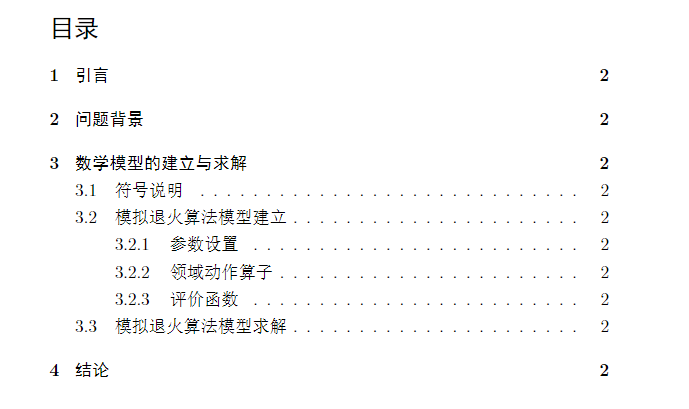
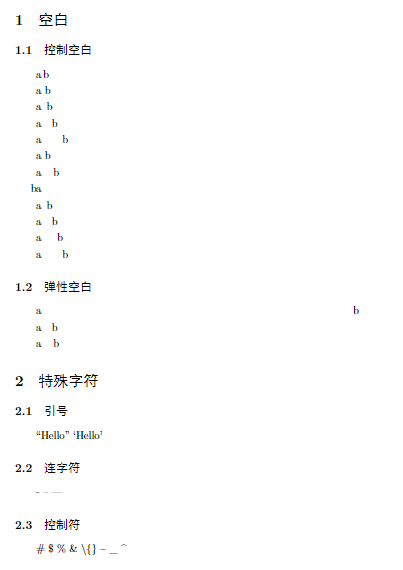
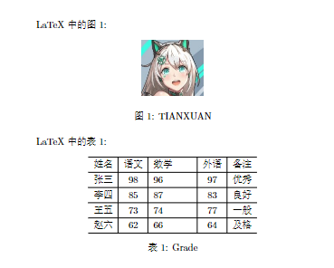
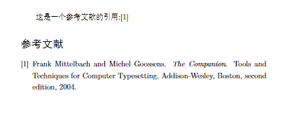
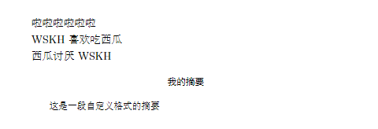

# 基本结构



```latex
% 导言区
\documentclass[12pt, a4paper]{article}
\usepackage[utf8]{inputenc}	
\usepackage{ctex}

\title{\kaishu First Paper} 			% 文章名字（楷书）
\author{\heiti biglonglong}			% 作者姓名（黑体）
\date{\today} 					% 日期

 % 正文区
\begin{document}
	\maketitle 					% 打印封面

	Hello \TeX 
	
	你好，LaTex 
	
	Let $f(x)$ define:			% 表达式
	$$f(x)=x^2+x+1$$			% 公式块
\end{document}
```

## 导言区

> 定义文档的格式、语言等全局设置

### \documentclass

```latex
% 设置文档格式
\documentclass[options]{class}
```

| Options                  | Intro                                                        |
| ------------------------ | ------------------------------------------------------------ |
| 10pt, 11pt, 12pt         | 设置文档中主要字体的大小。如果没有指定选项，则假定为 10pt。  |
| a4paper, letterpaper,... | 定义纸张大小。默认尺寸为 Letterpaper；不过，现在许多欧洲发行的 TeX 都预设为 A4，而不是 Letter，pdfLaTeX 的所有发行版本也是如此。除此之外，还可以指定 a5paper、b5paper、executivepaper 和 legalpaper。 |
| fleqn                    | 将显示的公式排版为左对齐，而不是居中。                       |
| leqno                    | 将公式编号放在左侧而不是右侧。                               |
| titlepage, notitlepage   | 指定是否在文档标题后开始新页面。文章类默认不启动新页面，而报告和书籍类则启动新页面。 |
| twocolumn                | 指示 LaTeX 以两列而不是一列排版文档。                        |
| twoside, oneside         | 指定应生成双面还是单面输出。文章和报告类默认为单面，书籍类默认为双面。请注意，该选项只涉及文件的样式。选项 twoside 并不表示打印机应双面打印。 |
| landscape                | 将文档布局更改为横向打印。                                   |
| openright, openany       | 使章节只从右侧页面开始，或从下一页开始。这对文章类无效，因为它不知道章节。报告类默认从下一页开始，而书籍类则从右侧页面开始。 |
| draft, final             | 草稿会让 LaTeX 在问题行的右侧空白处用一个小方块显示连字符和对齐问题，以便人工快速查找。此外，它还会抑制图片的加入，只在图片通常出现的地方显示一格。 |

| Class                      | Intro                                                        |
| -------------------------- | ------------------------------------------------------------ |
| article                    | 用于科学期刊论文、演讲、简短报告、计划文件、邀请函......     |
| IEEEtran                   | 对于采用 IEEE Transactions 格式的文章。                      |
| proc                       | 基于文章类的程序类。                                         |
| minimal                    | 它已经小到不能再小了。它只设置页面大小和基本字体。它主要用于调试目的。 |
| report                     | 对于包含多个章节的长篇报告、小型书籍、论文...                |
| book                       | 书籍方面                                                     |
| slides                     | 用于幻灯片。全班使用大号无衬线字体。                         |
| memoir                     | 用于合理地改变文档的输出。它基于书籍类，但你可以用它创建任何类型的文档 |
| letter                     | 用于写信                                                     |
| beamer                     | 用于撰写演示文稿                                             |
| ctexart、ctexrep、ctexbook | 适配中文的论文、报告、书籍等                                 |

### \usepackage

```latex
% 导入扩展包
\usepackage[utf8]{inputenc}		% UTF-8 编码
\usepackage{ctex} 				% 中文支持
...
```

### 封面

```latex
% 设置封面格式
\title{style title_name} 		% 文章名字(字体)
\author{style author_name} 	% 作者姓名(字体)
\date{date} 			% 日期
% 以\maketitle命令生成封面
```

## 正文区

```latex
% 正文区:一个LaTeX文件只有一个document，以公式、命令构成document
\begin{document}
	\maketitle % 将标题打印出来
	Hello \TeX
\end{document}
```


# 字体



```latex
\documentclass[12pt,a4paper]{article}
\usepackage{ctex}
\newcommand \myfont {\huge{\textbf{\textit{Hello}}}}

\begin{document}
	% 字体族
	{\rmfamily Hello}
	{\ttfamily Hello}
	
	% 字体大小
	{\tiny Hello} \\
	{\scriptsize Hello} \\
	{\footnotesize Hello} \\
	{\small Hello} \\
	{\normalsize Hello} \\
	{\large Hello} \\
	{\Large Hello} \\
	{\LARGE Hello} \\
	{\huge Hello} \\
	{\Huge Hello} \\
	
	% 英文字体格式设置
	\textbf{Hello} 	% 加粗
	\textit{Hello} 	% 斜体
	
	% 复杂字体设置
	{\huge{\textbf{\textit{Hello}}}} \\
	\myfont
	
\end{document}
```

## 字体族

```latex
\textrm{罗马字体内容}
\textsf{无衬线字体}
\texttt{打字机字体内容}
```

```latex
{\rmfamily 罗马字体内容}
{\ttfamily 打字机字体内容}
```

## 字体大小

```latex
% 字号设置
{\tiny Hello} \\
{\scriptsize Hello} \\
{\footnotesize Hello} \\
{\small Hello} \\
{\normalsize Hello} \\
{\large Hello} \\
{\Large Hello} \\
{\LARGE Hello} \\
{\huge Hello} \\
{\Huge Hello} \\

% 中文字号设置
\zihao{5} 你好
```

## 字体格式

```latex
% 英文字体格式设置
\setmainfont[BoldFont=Times New Roman,AutoFakeBold={3.5}]{Times New Roman}
\textbf{Hello} 	% Times New Roman的3.5加粗
\textit{Hello} 	% Times New Roman的斜体

% 中文字体格式设置，ctex包含对setCJKmainfont的默认设置
\setCJKmainfont[AutoFakeBold=10,ItalicFont={楷体}]{宋体}
\textbf{你好} 	% 参数为10的伪粗宋体
\textit{你好} 	% 以楷体形式模拟伪斜体
```

## 自定义

```latex
% 多层格式嵌套
{\huge{\textbf{\textit{Hello}}}}
```

```latex
% 导言区定义字体样式
\newcommand{\myfont}{\huge{\textbf{\textit{Hello}}}}
% 正文区使用
\myfont
```


# 篇章结构



```latex
\documentclass[12pt,a4paper]{article}
\usepackage{ctex}

\begin{document}

	\tableofcontents

	\section{引言}
	\section{问题背景}
	\section{数学模型的建立与求解}
	\subsection{符号说明}
	\subsection{模拟退火算法模型建立}
	\subsubsection{参数设置}
	\subsubsection{领域动作算子}
	\subsubsection{评价函数}
	\subsection{模拟退火算法模型求解}
	\section{结论}
\end{document}
```

## \section 小节

```latex
\section{引言}
\section{问题背景}
\section{数学模型的建立与求解}
\section{结论}
```

## \subsection 子小节

```latex
\section{数学模型的建立与求解}
\subsection{符号说明}
\subsection{模拟退火算法模型建立}
\subsection{模拟退火算法模型求解}
```

## \subsubsection 子子小节

```latex
\section{数学模型的建立与求解}
\subsection{符号说明}
\subsection{模拟退火算法模型建立}
\subsubsection{参数设置}
\subsubsection{领域动作算子}
\subsubsection{评价函数}
\subsection{模拟退火算法模型求解}
```

## 目录



```latex
\tableofcontents
```


# 特殊字符



```latex
\documentclass{article}
\usepackage{ctex}

\begin{document}
    \section{空白}
        \subsection{控制空白}
            a\thinspace b\par         %1/6em
            a\ b\par                  %1个空格
            a\enspace b\par			  %1/2em
            a\quad b\par              %1em
            a\qquad b\par			  %2em
            a~b\par                   %硬空格

            a\kern 1pc b\par
            a\kern -1em b\par 
        
            a\hphantom{1}b\par
            a\hphantom{12}b\par
            a\hphantom{123}b\par
            a\hphantom{1234}b\par
        
        \subsection{弹性空白}
            a\hfill b\par
            a\hskip 1em plus 0.5em minus 0.2em b\par
            a\hspace{12pt plus 10pt minus 5pt}b\par
	
	\section{特殊字符}
        \subsection{引号}
            ``Hello''   `Hello'
        \subsection{连字符}
            -   --   ---
        \subsection{控制符}
            \#   \$   \%   \&   \textbackslash   \{\}   \~{}   \_{}   \^{}  
        \subsection{排版符}
            \S   \P   \dag   \ddag   \copyright   \pounds
	
\end{document}
```

## 空白

### 空格

- 禁止使用中文全角空格
- 中文间空格编译后无空格，英文间或者中英文间空格编译后产生一个空格，其他情况间距由XeLateX处理
- 使用空格无法缩进
- **空行分段**，多个空行等同于1个，作用和`\par`相同，而`\\`是强制换行

### 空白字符

- 控制空白

  - `\,`、`\thinspace`，1/6em空白

  - `\enspace`，1/2em空白

  - `\quad`，1em空白，大概三个`\ `

  - `\qquad`，2em空白

  - `\ \ \ \ `…，多空格

  - `~`，不可断空格
  - `\kern`
    - `1pc`，12pt空白
    - `12pt`，1pc空白
    - `-1em`，移除1em空白
  - `\hphantom{...}`，根据…内容长度空白
- 弹性空白
  - `\hfill`，让两边字符正好到达纸张边界
  - `\hskip 1em plus 0.5em minus 0.2em`、`\hspace{1em plus 0.5em minus 0.2em}`，1em初始空白，允许根据需要增加最多0.5em或减少最多0.2 em宽度


## 引号

```latex
``Hello''    `Hello'
```

## 连字符

```latex
-    --    ---
```

## 控制符

```latex
\#   \$   \%    \&   \{\}   \~{}   \_{}   \^{}   \textbackslash
```

## 排版符

```latex
\S  \P  \dag  \ddag  \copyright  \pounds
```


# 浮动体

> 插图：
>
> 1. `\usepackage{graphicx}` ，插图宏包
> 2. `\graphicspath{{fig1/},{fig2/}}` ，指定插图文件夹 
> 3.  
>
> \textbackslash begin\{tabular\}[<垂直对齐方式>]\{<列格式说明>\}\par
>
>   <列格式说明>：\par
>
>   l:左对齐 \quad c:居中 \quad r:右对齐 \quad p\{<宽度>\} \quad |:在该位置增加竖线\par
>
>   

> 1. 避免无法分割的内容产生分页留白；常用选项[htbp]浮动格式，按h-t-b-p顺序避免留白
>    - 『h』放于当前位置、『t』放于顶部、『b』放于底部、『p』放于浮动页。
> 2. 给图表添加标题
> 3. 交叉引用



```latex
\documentclass{article}
\usepackage{ctex}
\usepackage{graphicx}  				
\graphicspath{{fig1/},{fig2/}}   

\begin{document}
	\includegraphics[width=6cm,height=6cm]{2.png}\par

	LaTeX中的图\ref{f1}:
	\begin{figure}[htbp] 
		\centering 
		\includegraphics[scale=0.5]{1.png}
		\caption{TIANXUAN}
		\label{f1}
	\end{figure}

	LaTeX中的表\ref{t1}:
	\begin{table}[htbp] 
		\centering
        \begin{tabular}{l|c|p{1.5cm}|c|r}  
            \hline 								% \hline为表格增加一条横线
            姓名 & 语文 & 数学 & 外语 & 备注 \\
            \hline
            张三 & 98 & 96 & 97 & 优秀 \\
            \hline
            李四 & 85 & 87 & 83 & 良好 \\
            \hline
            王五 & 73 & 74 & 77 & 一般 \\
            \hline
            赵六 & 62 & 66 & 64 & 及格 \\
            \hline
        \end{tabular}
        \caption{Grade}
		\label{t1}
	\end{table}
	
\end{document}
```


# 公式

## 行内公式

```latex
$a+b=b+a$
\(a+b=b+a\)
\begin{math}a+b=b+a\end{math}
```

## 行间公式

```latex
$$a+b=b+a$$
\[a+b=b+a\]
\begin{displaymath}a+b=b+a\end{displaymath}

函数\ref{e1}:
\begin{equation}
    a+b=b+a \label{e1}
\end{equation}
```

## 上下标

```latex
$x^2+y^4=z^3$
$P_i+N_j=M_k$
```

## 分式

```latex
$\frac{1}{5}$
```

## 简单矩阵

```latex
\usepackage{amsmath}

$\begin{matrix}
    0 & 1 \\
    1 & 0
\end{matrix}$

$\begin{pmatrix}
    0 & 1 \\
    1 & 0
\end{pmatrix}$

$\begin{bmatrix}
    0 & 1 \\
    1 & 0
\end{bmatrix}$

$\begin{Bmatrix}
    0 & 1 \\
    1 & 0
\end{Bmatrix}$

$\begin{vmatrix}
    0 & 1 \\
    1 & 0
\end{vmatrix}$

$\begin{Vmatrix}
    0 & 1 \\
    1 & 0
\end{Vmatrix}$
```

## 希腊字母

```latex
$\alpha$
$\beta$
$\gamma$
$\epsilon$
$\Delta$
$\Theta$
$\Omega$
$\pi$
$\omega$
```

## 数学函数

```latex
$\log$
$\sin$
$\cos$
$\arcsin$
```

## 多行公式

```latex
\usepackage{amsmath}
\usepackage{amssymb}

\begin{gather}		% 带编号
	a+b=b+a \\
	f(x)=x^2+x+1
\end{gather}

\begin{gather*}		% 不带编号
	a+b=b+a \\
	f(x)=x^2+x+1
\end{gather*}

\begin{align}		% align环境，用&对齐
    a+b&=b+a \\
    f(x)&=x^2+x+1
\end{align}

\begin{align*}		% align环境，不带编号
    a+b&=b+a \\
    f(x)&=x^2+x+1
\end{align*}

\begin{equation}	% split环境，用&对齐，编号在中间
    \begin{split}
        a+b&=b+a \\
        f(x)&=x^2+x+1
    \end{split}
\end{equation}

\begin{equation}	% cases环境，用&分为两部分，表值和条件
    f(x)=\begin{cases}
        1,&x>0 \\
        0,&x=0 \\
        -1,&x<0
    \end{cases}
\end{equation}
```


# 参考文献



```latex
% 1.bib
@BOOK{mittelbach2004,
	title = {The Companion},
	publisher = {Addison-Wesley},
	year = {2004},
	author = {Frank Mittelbach and Michel Goossens},
	series = {Tools and Techniques for Computer Typesetting},
	address = {Boston},
	edition = {Second}
}
```

```latex
% 根据当前目录下的1.bib文件，生成参考文献章节
\documentclass{article}
\usepackage{ctex}
\bibliographystyle{plain} 	% 指定参考文献样式

\begin{document}
	这是一个参考文献的引用:\cite{mittelbach2004}
	
	% 默认情况下，只有被引用的参考文献才会被列出，如果想列出没被引用的参考文献可以使用\nocite{*}命令
	% \nocite{*}
	\bibliography{1}
	
\end{document}
```


# 自定义命令和环境



```latex
\documentclass{article}
\usepackage{ctex}

% 无参数定义新命令
\newcommand\PRC{啦啦啦啦啦啦}
% 有参数定义新命令 [n] n个参数
\newcommand\loves[2]{#1 喜欢 #2}
\newcommand\hate[2]{#1 讨厌 #2}

% 定义摘要环境
\newenvironment{myabstract}[1][摘要]	%定义新环境myabstract，可接受一个可选参数（默认为“摘要”）
{\small
	\begin{center}
		\bfseries #1
	\end{center}
	\begin{quotation}
}
{\end{quotation}}

\begin{document}
	\PRC  \par
	\loves{WSKH}{吃西瓜}  \par
	\hate{西瓜}{WSKH}  \par
	
	\begin{myabstract}[我的摘要]
		这是一段自定义格式的摘要
	\end{myabstract}
\end{document}
```

​      