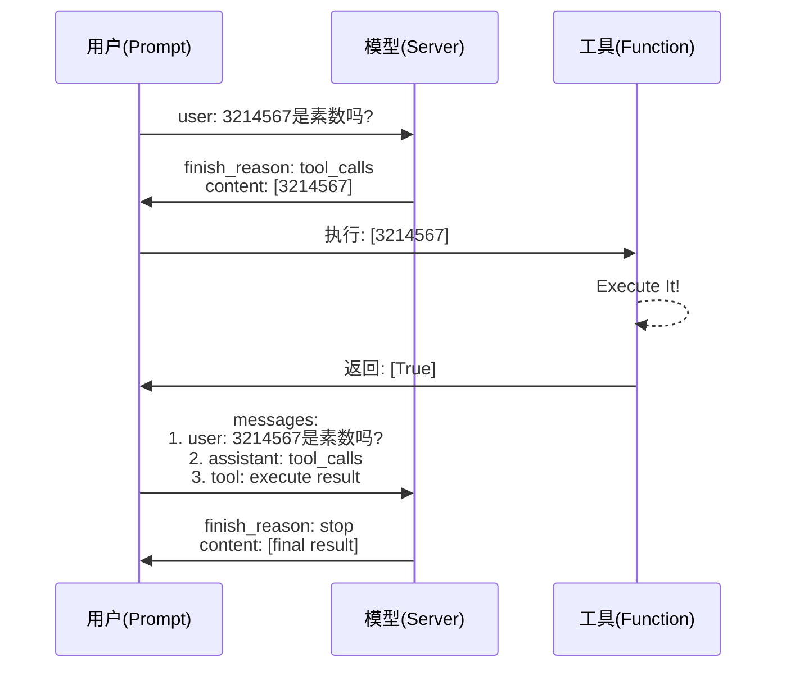
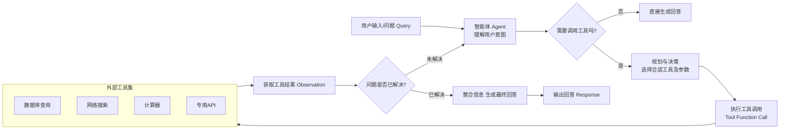

## GPUs

### 模型参数

模型本质上是一个巨大的数字矩阵（权重矩阵）。存储这些数字需要显存，每个数字占多少字节由精度决定。

| 精度     | 字节/数字 | 通俗理解                                     |
| :------- | :-------- | :------------------------------------------- |
| FP32     | 4         | 单精度浮点数，精度最高，占空间最大           |
| FP16     | 2         | 半精度，精度适中，速度更快                   |
| **BF16** | **2**     | **专为AI设计的半精度，动态范围大，不易溢出** |
| INT8     | 1         | 整数，精度低，但计算快、省显存               |
| INT4     | 0.5       | 极端压缩，适合边缘设备                       |

大模型参数量通常以十亿（B）为单位，该单位大小等同于 G；所以 7B 模型 FP16 占 14GB，INT4 只占 3.5GB——因为字节数从 2 降到了 0.5。

### 推理 VS 训练 

推理时只需要存模型参数，因此下界为模型大小，但有了加速推理而生的KV Cache开启时，显存需求可以翻倍；

```
KV Cache (GB) = 2 × 层数 × 头维度 × 序列长度 × 精度字节 × batch_size / 1024³
```

训练时需要额外存额外参数，如使用 BF16 训练 + AdamW 优化器：

| 组件       | 精度      | 每参数字节数 | 相对模型倍数 | 说明                             |
| :--------- | :-------- | :----------- | :----------- | :------------------------------- |
| 模型权重   | BF16      | 2 Bytes      | **1×**       | 前向/反向推理基础                |
| 梯度       | BF16      | 2 Bytes      | **1×**       | 反向传播产生，与权重同形         |
| 优化器状态 | FP32      | 8 Bytes      | **4×**       | AdamW 需 m (4B) + v (4B)         |
| 主权重副本 | FP32      | 4 Bytes      | **2×**       | 更新时防止 BF16 下溢             |
| 中间激活   | BF16~FP32 | 2~4 Bytes    | **4~5×**     | 前向传播的中间结果，用于梯度计算 |

总计至少 12 倍，但当关闭 FlashAttention（闪存注意力）、关闭 Selective Activation Checkpointing（选择性重计算）、大 Batch、长 Seq时，可能总计达 20 倍。

### 量化

FP16 的数字范围是 `-65504 ~ 65504`，但模型权重大部分集中在 `-2 ~ 2` 之间。INT8 量化就是把 `-2~2` 这个区间映射到 `-128~127`，虽然精度从 65536 个等级降到 256 个等级，但对最终输出影响很小。

### 预估

实际显存(GB) = 参数量(B) × 精度字节数 × 场景系数

| 场景               | 系数      | 构成                             |
| :----------------- | :-------- | :------------------------------- |
| **推理（短文本）** | 1.2 ~ 1.5 | 模型 + KV Cache + CUDA开销       |
| **推理（长文本）** | 1.5 ~ 3.0 | 模型 + 大KV Cache                |
| **LoRA 微调**      | 1.5 ~ 2.5 | 模型 + 低秩矩阵 + 少量优化器状态 |
| **全量微调**       | 12 ~ 16   | 参数 + 梯度 + 优化器 + 激活      |
| **预训练**         | 16 ~ 20   | 同上，批量更大                   |

显卡选型

| 显存需求    | 推荐方案                    |
| :---------- | :-------------------------- |
| < 8 GB      | 任何入门卡                  |
| 8 ~ 16 GB   | RTX 4060 / 3060             |
| 16 ~ 24 GB  | RTX 4090（最佳性价比）      |
| 24 ~ 48 GB  | A6000 48GB 或 2×4090        |
| 48 ~ 160 GB | 多卡（2~4 张 4090 或 A100） |
| > 160 GB    | 租云或企业级集群            |

### OOM

1. 减小批次大小，线性降低训练速度

```python
per_device_train_batch_size=1  # 减小批次处理
gradient_accumulation_steps=4   # 补偿大批次效果
```

2. 开启梯度检查点，训练耗时增加约 30%

```python
model = AutoModelForCausalLM.from_pretrained(
    ...,
    use_cache=False  # 禁用训练无用 transformer KV缓存
)
model.gradient_checkpointing_enable()	# 检查点分块 前/后向传播
```

3. 使用更低精度，减小数据宽度，可能存在梯度消失

```python
dtype=torch.bfloat16 # 模型用bf16
bf16=True  # 优化器用bf16
```

4. 缩短序列长度，降低输入数据完整性，矩阵级减少显存占用

```python
max_length=512  # 减小注意力矩阵大小
```

5. 模型加载优化

```python
model = AutoModelForCausalLM.from_pretrained(
    ...,
    device_map="auto",  # 显存不足，自动分配设备
    low_cpu_mem_usage=True	# double 内存不足，边加载边移动
)
```

6. 数据加载优化

```python
ds = load_dataset("openai/gsm8k", "main", streaming=True) # 返回 IterableDataset
```

7. 使用DeepSpeed（ZeRO-3）

```python
# pip install deepspeed
training_args = TrainingArguments(
    ...,
    deepspeed="ds_config.json"
)
```


## Client

| 参数                  | 说明                                                         |
| --------------------- | ------------------------------------------------------------ |
| **model**             | 指定使用的模型 ID                                            |
| **messages**          | 对话消息列表，每条含 `role`（`system`设定对话的背景、规则、身份和整体行为准则/`user`模型需要回应、处理或遵循的指令、问题或陈述/`assistant`模型做出的回复）和 `content`（参考 [提示词工程](#prompt-engineering)） |
| **stream**            | `True`：流式逐块返回；`False`：等待后一次性返回完整结果      |
| **temperature**       | 调整 Next Token 概率分布的平滑度，值越高，所有词的概率越接近，选择更随机；值越低，高概率词的概率被放大，选择更确定 |
| **top_p**             | 按累计概率 P 截断候选词池（动态）                            |
| **top_k**             | 只保留概率最高的 K 个候选词                                  |
| **deep thinking**     | 开启：慢但可推理，适合复杂任务；关闭：快但直接，适合简单问答 |
| **n**                 | 一次生成返回的结果数量                                       |
| **max_tokens**        | 生成内容的最大 token 上限                                    |
| **response_format**   | `{"type": "text"}`（默认 markdown）或 `{"type": "json_object"}`（强制输出 JSON） |
| **stop**              | 遇到该词立即停止输出，该词本身不输出                         |
| **presence_penalty**  | 新生成的词汇按"是否出现过"降低重复 token 概率                |
| **frequency_penalty** | 新生成的词汇按"出现频次"降低重复 token 概率                  |


## Agent

- [基座模型](#base-model)：在大规模无标注数据上预训练得到的通用语言模型，作为下游任务微调或上下文学习的参数化知识底座。
- [提示词工程](#prompt-engineering)：通过设计、优化输入序列（含指令、示例、推理链等）来引导冻结参数的语言模型输出符合预期分布的响应，属于推理时干预。
- 解析器：针对异构多模态输入（PDF、图像、音频等）进行内容抽取、格式转换与语义分块，将非结构化数据转化为模型可处理的文本向量序列；同时对模型输出内容进行抓取。
- [检索增强](#rag)：在生成过程中，从外部非参数化知识库中检索与当前上下文相关的信息片段，并将其作为条件前缀注入输入序列，以修正参数化知识的时间滞后性与事实偏差。
- [工具调用](#tools)：模型通过生成符合预定义JSON Schema的Function Call，请求外部系统执行确定性操作（API调用、数据库查询等），并将执行结果拼接回上下文以完成闭环；MCP（模型上下文协议）旨在统一异构工具接口的交互标准。
- [工作流设计](#workflow)：基于Agent框架（如LangChain）构建有向图（DAG）或状态机，将LLM作为推理引擎编排多轮工具调用、分支判断与循环迭代，形成可复用的复合任务执行管线。
- [Post-Train](#post-train)
  - 微调： 在预训练模型基础上，用有监督的领域指令数据对全部或部分参数进行梯度更新，使模型的条件分布向目标任务空间偏移，实现领域适应。
  - 强化学习：将语言生成建模为序贯决策问题，使用奖励模型（RM）对策略模型（Policy）的输出进行偏好评分，通过策略梯度（如PPO）优化模型参数，使生成分布与人类偏好对齐。


## Base Model

生成过程本质上是对 token 序列的条件概率分布进行参数化建模，并通过随机采样策略（如温度、top-p 等）从该分布中逐 token 递推采样，从而完成文本生成；

基座模型的选择，需要考虑**模态与语言支持、生态开源或闭源、规模与成本、专业能力与领域数据、上下文长度、文档解析能力**，现有的大模型不计其数，可以借助大模型检索能力推荐；

- [Chatbot Arena + | OpenLM.ai](https://openlm.ai/chatbot-arena/)
  - [Open LLM Leaderboard - a Hugging Face Space by open-llm-leaderboard](https://huggingface.co/spaces/open-llm-leaderboard/open_llm_leaderboard#/)
  - [SuperCLUE中文大模型测评基准-AI评测榜单](https://superclueai.com/homepage)
  - [Humanity's Last Exam](https://lastexam.ai/)
- [LLM Models Comparison - Token Calculator](https://www.token-calculator.com/models)

经小规模评估验证在特定任务上表现达标的基座模型，再通过针对性投入高质量领域数据与算力进行微调或强化学习，方能有效激发其在该任务上的潜力，最终锻造出在该领域表现卓越的专业化模型。

### Qwen

### Llama


## Prompt Engineering

1. LLMs对提示词开头和结尾的内容更敏感，可收缩问题域，减少二义性

   - 开头：设定角色和任务
   - 结尾：规定输出格式
2. 提供清晰明确的任务描述，模糊的指令导致模糊的输出

   - 清晰明确：使用动作动词（撰写、总结、分类、翻译、生成、推理）
   - 分解子任务：用“第一步、第二步...”梳理任务逻辑

   - 思维链（CoT）：指令要求“逐步推理”触发，或者构建链式程序
   - 思维树（ToT）：指令要求“多分支推理”触发，或者构建树式程序
   - 一致性优化：指令要求”给出多个推理过程并选择最佳结果“，或者构建投票或权重程序
3. 上下文背景 或 RAG：可供参考的背景知识
4. 提供样本输入输出示例
5. 附加系统提示词约束

> ==让大模型优化你的提示词！！！==
>
> I want you to become my Expert Prompt Creator. Your goal is to help me craft the best possible prompt for my needs. The prompt you provide should be written from the perspective of me making a request to [ChatGPT]. Please keep in mind that the final prompt will be used directly with [ChatGPT]. The process is as follows:
>
> 1. **Your response must include the following sections:**
>    - **Prompt:** {Provide the best possible prompt according to my request.}
>    - **Critique:** {Provide a concise paragraph on how to improve the prompt. Be very critical in your response.}
>    - **Questions:** {Ask any questions pertaining to what additional information you need from me to improve the prompt (max of 3 questions). If the prompt needs more clarification or details in certain areas, ask questions to get more information to include.}
> 2. I will then answer your questions. You must incorporate my answers into the next revised prompt using the same format. We will continue this iterative process with me providing additional information and you updating the prompt until it is perfected.
>
> Remember, the prompt we are creating should be written from the perspective of me making a request to [ChatGPT]. Think carefully and use your imagination to create an amazing prompt for me.
>
> **Your first response should only be a greeting and to ask me what the prompt should be about.**
>
> ------
>
> 我希望您能担任我的专业提示词创建专家。您的目标是帮助我根据需求打造最优质的提示词。您提供的提示词应当从我向[ChatGPT]提出请求的视角来撰写。请注意，最终完成的提示词将直接用于[ChatGPT]交互。流程如下：
>
> 1. **您的回复必须包含以下部分：**
>    - **提示词：** {根据我的需求提供最优提示词方案}
>    - **优化建议：** {用批判性视角提供改进建议，以简练段落说明如何提升提示词质量}
>    - **追问：** {提出最多3个关键问题，询问需要哪些补充信息来优化提示词。若提示词某些方面需要更详尽的说明，应通过提问获取更多细节}
>
> 2. 我将回答您的提问。您必须将我的回答整合到新的修订版提示词中，并保持相同格式。我们将持续这个迭代过程：我提供补充信息，您则相应更新提示词，直至达到完美效果。
>
> 请谨记：我们共同创建的提示词必须从我向[ChatGPT]提出请求的视角撰写。请充分发挥创造力和思考力，为我打造卓越的提示词方案。
>
> **您的首次回复应当仅为问候语，并询问我希望提示词的主题方向。**


## RAG

依据任务指令（Prompt），提炼用户查询请求（Query），通过检索器（Retriever）在知识库中查找相关内容，以作为大语言模型进行工具调用或生成回答时的补充上下文。


主要依赖以下几个关键模块：：知识库原数据文本解析与分块，文本摘要，句子嵌入模型（Sentence Embedding）、向量数据库（Vector DB）及其检索器（Retriever）

Sentence Embedding：

| 嵌入模型来源           | 部署 | 速度 | 成本        | 特性                    |
| ---------------------- | ---- | ---- | ----------- | ----------------------- |
| HuggingFace Embeddings | 本地 | 快   | 免费        | 离线使用                |
| OpenAI Embeddings      | 云端 | 中   | 付费API key | 更高精度、 更多语言支持 |

Vector DB：

| 数据库   | 部署 | 速度 | 扩展性 | 成本   | 易用性 | 特性                                     | 场景        |
| -------- | ---- | ---- | ------ | ------ | ------ | ---------------------------------------- | ----------- |
| Chroma   | 本地 | 中   | 小规模 | 免费   | 高     | 基础语义完整                             | 开发        |
| Pinecone | 云端 | 快   | 大规模 | 免费层 | 高     | 最新检索算法、命名空间、元数据过滤、监控 | 生产        |
| FAISS    | 本地 | 最快 | 中规模 | 免费   | 中     | 丰富的索引算法、GPU 加速                 | 离线/高性能 |


## Tools

在提示词中包含触发函数或工具的语义，模型能够智能输出一个包含调用一个或多个函数所需的参数的 JSON 对象，具体工作流如下：



系统上的构建多轮调用，直到`final_response`：



存在局限性：

- 依赖模型判断，可能误用或漏用
- 参数解析易出错，需额外做健壮的解析与校验
- 不支持动态或复杂工具，不适合高延迟、有状态或需用户授权的操作
-  多轮调用逻辑复杂，容易陷入无限循环


## WorkFlow

- [LangChain](https://www.langchain.com/) | [LangGraph](https://docs.langchain.com/oss/python/langgraph/overview) | [LangSmith](https://smith.langchain.com/)


## Data Management

- 数据挖掘：从原始数据来源中提取与目标任务相关的有效信息
- 数据清洗：对挖掘的数据设置质量过滤、去重策略、合规性检查
- 数据增强：通过不同角度，构造一条或多条 Q&A / Preference Pair，格式尽量统一
- 数据验证：对数据集进行格式验证
- 数据配比：训练数据集的选择与配比
- 数据评测：设置验证集，对模型 checkpoint进行针对性效果验证
- 数据分析：数据的成分统计，或者数据对模型性能影响的归因分析

上述过程中使用 LLM as XXX 是一个不错的思路！！！


## Post-Train

### Fine-tuing

#### Structure-Tuning（结构微调）

冻结预训练模型主体，仅对部分层或插入的附加模块（如 Adapter、Prefix Tuning）进行参数更新。

#### Full-Tuning（全量微调）

在预训练模型基础上，使用**领域任务数据**对所有参数进行端到端梯度更新，不冻结任何层，使其输出分布更贴近目标任务的需求。

适合在数据、算力充足时追求领域极致性能、或者目标任务与预训练任务差异巨大时使用；但 -> 

（a）易灾难性遗忘：如果任务数据量小或领域过于狭窄，模型可能过度适应新数据，而丢失宝贵的通用知识和能力

（b）易过拟合：在数据量有限的情况下，拥有海量参数的全量微调非常容易过拟合到训练集上

#### LoRA-Tuning（低秩适配）

冻结预训练权重 $W_0$，在每层旁路添加低秩分解矩阵：
$$
h = W_0 x + B A x, \quad B \in \mathbb{R}^{d \times r}, \; A \in \mathbb{R}^{r \times k}, \; r << min(d,k)
$$
产出轻量适配器插件$\Delta W = BA$，使基础模型输出分布偏向目标任务的需求，并可将 $W_0$ 合并进 $W_1$ 原模型。

| 参数        | 范围      | 默认 | 调优逻辑                                                     |
| :---------- | :-------- | :--- | :----------------------------------------------------------- |
| **秩 r**    | 1~64      | 8    | 任务越复杂/数据越多 → r 越大；简单分类 1~4，代码生成 16~32，数学推理 32~64 |
| **缩放 α**  | 1~256     | 16   | 与学习率协同，通常 α = 2×r                                   |
| **学习率**  | 1e-5~1e-3 | 1e-4 | 比全量微调大 10 倍（因为只调少量参数）                       |
| **Dropout** | 0~0.5     | 0.1  | 过拟合时提高                                                 |

适合在数据、算力有限，或者多任务学习、或者任务强化时使用；但低秩空间无法达到任务的精确控制。

### RL

#### PPO（近端策略优化）

解决策略更新步长过大导致的训练崩溃问题。
$$
L^{CLIP}(\theta) = \mathbb{E}_t \left[ \min \left( r_t(\theta) \hat{A}_t, \ \text{clip}(r_t(\theta), 1-\epsilon, 1+\epsilon) \hat{A}_t \right) \right]
$$

- $r_t(\theta)$：新策略与旧策略的概率比值 $\frac{\pi_\theta(a_t|s_t)}{\pi_{\theta_{old}}(a_t|s_t)}$，来自于**参考模型**；所以 r 变大 = 当前策略下该动作概率上升，r 变小 = 当前策略下该动作概率下降。

  - $\epsilon$：裁剪超参，通常0.1~0.2，强行将更新幅度限制在 $1-\epsilon, 1+\epsilon$ 内，防止策略突变

    | 动作 | 优势 A^ | 比值 r              | clip(r)A^ | `min` 选谁 | 实际效果                                     |
    | :--- | ------- | :------------------ | :-------- | :--------- | :------------------------------------------- |
    | 好   | +1      | 1.5（动作概率上升） | +1.2      | Clip项     | 限制鼓励（好过头也不给太多奖励，防止过拟合） |
    | 好   | +1      | 0.5（动作概率降低） | +0.8      | 真实项     | 允许快速修正（赶紧把好动作概率提上来）       |
    | 差   | -1      | 1.5（动作概率上升） | -1.2      | 真实项     | 严厉惩罚（差动作概率反而涨了，重罚）         |
    | 差   | -1      | 0.5（动作概率降低） | -0.8      | Clip项     | 停止过度惩罚（差动作已经降够了，别继续压了） |

- $\hat{A}_t$：优势函数，衡量当前动作比平均表现好多少，来自于**价值模型** + **奖励模型** + 贝尔曼方程推导；

适合追求极致效果的工业级大模型

#### GRPO（组相对策略优化）

**弃用价值网络，专为降低训练显存设计，用组内相对奖励替代优势函数**，目标函数仍沿用PPO的裁剪损失。
$$
\hat{A}_{i,t} = \frac{r_i - \text{mean}(\mathbf{r})}{\text{std}(\mathbf{r})}
$$

- $r_i$：针对同一个Prompt，采样出的一组（Group，如4~16个）完整回复中第 $i$ 个的奖励分数；
- $\mathbf{r}$：该组内所有回复的奖励集合

平衡显存与效果的折中方案，特别适合长文本推理场景

#### DPO（直接偏好优化）

**弃用优势函数，绕过强化学习过程**，通过变量代换，将奖励模型的拟合过程直接嵌入策略网络，隐含地最大化优选与劣选回复之间的隐式奖励差距，从而绕开显式的奖励建模和环境交互。
$$
L_{DPO}(\theta) = -\mathbb{E}_{(x, y_w, y_l)} \left[ \log \sigma\left( \beta \log\frac{\pi_\theta(y_w|x)}{\pi_{ref}(y_w|x)} - \beta \log\frac{\pi_\theta(y_l|x)}{\pi_{ref}(y_l|x)} \right) \right]
$$


- $y_w, y_l$：人工标注的优选（Win）和劣选（Lose）回复。
- $ \pi_{ref} $：冻结的参考策略，通常是SFT微调后的初始模型。
- $ \beta $：温度系数，控制偏离参考模型的程度。

适合数据质量高、算力有限的场景

### Hyperparam

| 超参数               | 参数说明                                                     |
| -------------------- | ------------------------------------------------------------ |
| 迭代轮次             | 迭代轮次（Epoch），控制模型训练过程中遍历整个数据集的次数。建议设置在1-5之间，小数据集可增大Epoch以促进模型收敛。 |
| 学习率               | 学习率（Learning Rate），控制模型参数更新步长的速度。过高会导致模型难以收敛，过低则会导致模型收敛速度过慢，平台已给出默认推荐值，可根据经验调整。 |
| 单卡批大小           | 单卡批大小（Per Device Batch Size），单卡每次训练迭代使用的样本数，为了加快训练效率。全局批大小 = 单卡批大小 * 卡数 |
| 序列长度             | 序列长度(Sequence Length)，单条数据的最大长度，包括输入和输出。超过该长度的数据在训练将被自动截断，单位为token。如果数据集中的文本普遍较短，建议选择较短的序列长度以提高计算效率。 |
| 预热比例             | 预热比例（Learning Rate Warmup），训练初期学习率预热步数占用总的训练步数的比例。学习率预热可以提高模型稳定性和收敛速度。 |
| LoRA Ranks           | LoRA 策略中的秩（LoRA Rank），决定了微调过程中引入的低秩矩阵的复杂度。较小的秩可以减少参数数量，降低过拟合风险，但可能不足以捕捉任务所需的所有特征；较大的秩可能增强模型的表示能力，但会增加计算和存储负担。 |
| LoRA Alpha           | LoRA微调中的缩放系数(LoRA Alpha)，定义了LoRA适应的学习率缩放因子。该参数过高，可能会导致模型的微调过度，失去原始模型的能力；改参数过低，可能达不到预期的微调效果。 |
| LoRA Dropout         | LoRA微调中的Dropout系数(LoRA Dropout)，用于防止lora训练中的过拟合。 |
| 学习率调整计划       | 学习率调整计划（Scheduler Type），用于在训练过程中动态调整学习率，以优化模型的收敛速度和性能。根据模型的训练情况和任务需求，选择合适的学习率调整方式。 |
| 正则化系数           | 正则化系数（Weight Decay），控制正则化项对模型参数的影响强度。适当增大系数可以增强正则化效果，防止过拟合，但过高的系数可能导致模型欠拟合。 |
| 验证步数             | 验证步数（Validation Steps），计算验证集Loss的间隔步数；为0时不开启验证，没有相关指标。 |
| Checkpoint保存间隔数 | Checkpoint保存间隔数（Checkpoint Interval），训练过程中保存Checkpoint的间隔Step数。间隔太短可能导致频繁的Checkpoint操作增加训练时长，间隔太长则可能在故障时丢失更多的数据。 |
| Packing              | 数据拼接(Packing)，将多条训练样本拼接到一个seqLen长度内。    |
| DPO偏好损失类型      | DPO中偏好损失类型（Loss Type)，可选择的类型包括sigmoid、ipo、kto_pair。sigmoid适用于一般情况，提供稳定训练过程，ipo可以纠正模型过度自信的问题，kto可以使模型更符合用户偏好。 |
| beta                 | 温度超参（Beta），温度超参beta用于控制模型输出分布的集中程度。较高的beta值会使输出更具确定性，而较低的beta值则使输出更具多样性。 |

### Metrics

| 指标                               | 含义                                                 | 判读方式                                                     |
| ---------------------------------- | ---------------------------------------------------- | ------------------------------------------------------------ |
| loss（训练损失）                   | 模型在训练数据上的预测误差                           | 应持续下降，表示模型在有效学习                               |
| eval_loss（验证损失）              | 模型在验证数据上的预测误差                           | 应持续下降，且与 loss 趋势一致                               |
| lr（学习率）                       | 当前的学习率数值                                     | 一般按预设策略自动调整                                       |
| grad_norm（梯度范数）              | 模型参数梯度的整体大小，用于反映训练过程中的更新幅度 | 应保持在合理范围内稳定波动；过大可能导致训练不稳定（梯度爆炸），过小可能导致学习缓慢或停滞（梯度消失） |
| rewards accuracies（奖励准确率）   | 模型正确区分优质回答和低质回答的比例                 | 越高越好，接近 1.0 表示模型已能有效区分                      |
| rewards margins（奖励差距）        | 模型对优质回答和低质回答的评分差距                   | 越大越好，表示区分能力越强                                   |
| rewards chosen（优质回答奖励值）   | 模型对优质回答的评分                                 | 应为正值且逐步提高                                           |
| rewards rejected（低质回答奖励值） | 模型对低质回答的评分                                 | 应为负值且逐步降低                                           |
| logps chosen（优质回答对数概率）   | 模型生成优质回答的概率                               | 应逐步提高                                                   |
| logps rejected（低质回答对数概率） | 模型生成低质回答的概率                               | 应逐步降低                                                   |


### Trick

- 使用LoRA，增大 Batch Size，降低 lr，能更好地学习通用规律，避免过拟合，泛化能力强
- 在任务数据中混入少量通用数据，来缓解灾难性遗忘
- 对 checkpoints 直接采用验证集，监控输出效果

