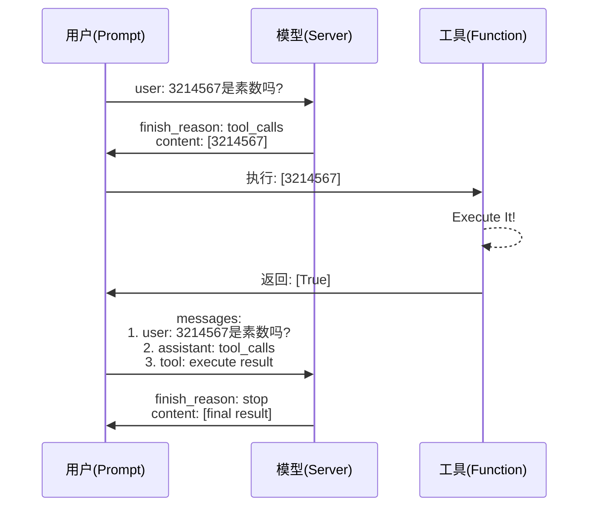
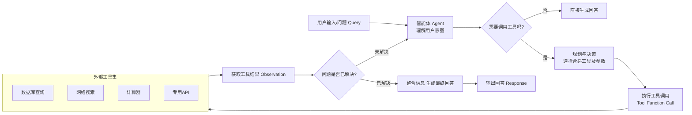

## GPUs

[大模型配置硬件参考自查表 - AI全书](https://aibook.ren/archives/llm-deploy-computility-table)[大模型配置硬件参考自查表 - AI全书](https://aibook.ren/archives/llm-deploy-computility-table)

- 参数规模：模型参数数量，以十亿（B）为单位，该单位大小与 GB 近似

  - 轻量级(1-7B)：适合个人电脑
  - 中量级(14-32B)：需要高性能显卡
  - 重量级(70B+)：需专业服务器

- 数据位宽：模型参数精度，权衡训练速度和显卡资源

  | 精度类型 | 字节/参数 | 适用场景 | 备注       |
  | -------- | --------- | -------- | ---------- |
  | FP32     | 4字节     | 混合训练 | 最高精度   |
  | **FP16** | 2字节     | 推理部署 | 平衡选择   |
  | **BF16** | 2字节     | 训练加速 | 专为AI优化 |
  | FP8      | 1字节     | 边缘设备 | 最大压缩   |

- 模型量化：模型参数压缩，通过牺牲模型精度，减小显存需求，常用于推理

  - CV 任务：INT8
  - NLP 任务：FP16
  - 大模型任务：混合INT8/FP16

- 矩阵运算：硬件加速、算法加速、线程并行

  - 模型过大：流水线并行
  - 矩阵过大：张量并行
  - 数据量过大：数据并行

对模型大小为$S$，量化后模型大小为$S'$，参数数量为$N$，每个参数的字节数为$B$，量化开销系数为$k \in [1.1, 1,2]$，中间结果大小
$$
S = N \times B
$$

$$
S' = N \times B' \times k
$$

训练时显存开销包括模型参数占用、梯度参数占用、优化器参数占用、中间结果和CUDA kernel占用；推理时显存开销包括模型参数占用、中间结果和CUDA kernel占用

|               阶段               | 近似显存占用（相对于原始模型大小） |
| :------------------------------: | :--------------------------------- |
|         训练 (Training)          | 12 ~ 20 倍                         |
|  全参数微调 (Full Fine-Tuning)   | 8 ~ 15 倍                          |
| 强化学习(Reinforcement Learning) | 4  ~ 20 倍（AdmaW）                |
|   LoRA微调 (LoRA Fine-Tuning)    | 1.2 ~ 2 倍                         |
|         推理 (Inference)         | 1.2 ~ 5 倍                         |


## Tasks

- 预测：经深度网络传播至单个神经元，以其标量输出作为预测结果
- 单标签分类：以 FFN 将上游特征传播至【标签数】个神经元上，经 softmax 转换为概率分布，取概率最高的标签作为分类结果
- 多标签分类：以 FFN 将上游特征传播至【标签数】个神经元上，经 sigmoid 计算各标签概率，取超过设定阈值的标签作为分类结果
- 文本|语音翻译：采用 Transformer 架构，编码器将源语言语句编码为语义表示，解码器依据该表示自回归生成目标语言词序列（内部同样经 softmax 转换为词汇表概率分布，取概率最高的词汇作为该轮预测结果）
- 文本生成：原任务转化为基于上下文的下一个词预测问题，一般采用 Transformer-Decoder 架构
- QA：合并 Question 和 Answer  为单个词序列，原任务转化为文本生成问题
- 涌现：当模型参数量（层数、宽度、token维度、隐藏层维度）和数据量（上下文长度、词汇表大小）疯狂扩大，无需改变此基础结构，会产生更强大的学习能力
- 套壳：利用闭源大模型API生成训练数据，预处理后全监督微调开源预训练模型，并用闭源大模型API评估训练效果
- 多模态：使用不同的编码器将不同模态的信息分别转换为向量表示， 模型学习不同模态信息之间的对应关系实现模态信息对齐， 将对齐后的信息融合到一个统一的表示中，以便进行后续的推理和决策。本质上还是nlp原理
- 强化学习：以奖励函数构建损失函数，引导反向传播


## Experiences

1. 模型训练三大件：

   数据（数据清洗【异常、NULL】、数据分布【多样化、归一化、正则化】、数据增强【翻转、裁剪】）、模型（激活函数、损失函数【正则化惩罚项】、优化器、学习率、复杂度【dropout】）、训练方法（批次大小、训练轮次、权重初始化）

2. 处理**过拟合|泛化能力**：

   降低模型复杂度、增加数据量、大批次、噪声

3. 处理**梯度消失|梯度爆炸|收敛速度**：

   梯度裁剪、残差网络、权重初始化、数据归一化、优化器

4. 大模型输出的**“包含”或“过滤”**：

   提示词组件，通过添加到消息中实现；RAG技术，通过限制知识库范围实现；基于规则，通过加载JSON进行后处理实现

5. 五个循序渐进**预训练任务**：

   Token掩码、句子重排、文本旋转、Token删除、文本填充


## API

### Server

- [lmdeploy](https://github.com/InternLM/lmdeploy)
- [vllm](https://github.com/vllm-project/vllm)
- [sglang](https://github.com/sgl-project/sglang)
- [Ollama（local）](https://ollama.com/)
- 官方部署在线服务 + `API_KEY`

### Client

#### sdk

- [x] [openai-python](https://github.com/openai/openai-python)

  ```python
  # create `.env` and add OPENAI_API_KEY=your_api_key
  from openai import OpenAI
  from dotenv import load_dotenv
  
  load_dotenv()
  api_key = os.getenv("OPENAI_API_KEY")
  client = OpenAI(
      api_key=api_key,
      base_url="${https://.../v1}",
  )
  
  chat_rsp = client.chat.completions.create(
      model="gpt-4",
      messages=[
          {"role": "", "content": ""}
      ],
      <Params...>
  )
  
  print(chat_rsp.id)	# 响应ID
  print(chat_rsp.model) # 模型信息
  print(chat_rsp.usage.prompt_tokens) # 输入token
  print(chat_rsp.usage.completion_tokens) # 输出token
  print(chat_rsp.usage.total_tokens) # 总token
  print(chat_rsp.choices[0].finish_reason) # 完成原因
  print(chat_rsp.choices[0].message.role) # 输出角色
  
  print(chat_rsp.choices[0].message.content) # 输出内容
  # # Stream=False
  # for choice in chat_rsp.choices:
  #     print(choice.message.content)
  # # Stream=True
  # full_response = ""
  # for chunk in chat_rsp:
  #     if chunk.choices[0].delta.content is not None:
  #         content = chunk.choices[0].delta.content
  #         print(content, end="", flush=True)
  #         full_response += content
  
  # openai.APIConnectionError
  # openai.RateLimitError
  # openai.APIError
  ```

- [ ] python_requests

- [ ] CLI

- [ ] curl

#### Params

##### model

官方支持模型 ID 之一，可通过官方文档或如下方式获取：

```python
model_list = client.models.list()
model_data = model_list.data

for i, model in enumerate(model_data):
    print(f"model[{i}]:", model.id)
```

##### messages

###### role

- `system`：设定对话的背景、规则、身份和整体行为准则。这是给模型的“内部工作指令”

- `user`：代表人类用户的输入。这是模型需要回应、处理或遵循的指令、问题或陈述

- `assistant`：代表模型自己之前做出的回复。这是对话历史中模型自身的输出记录，==多用于多轮对话==

  - `partial`：部分模型可预填（Prefill）部分模型回复来引导模型的输出格式、内容和场景一致性等，输出不包含预填内容
  
  ```python
  messages = [{"role": "system", "content": "..."},]
  
  def chat(input: str) -> str:
      global messages
  	messages.append({
  		"role": "user",
  		"content": input,	
  	})
   
  	chat_rsp = client.chat.completions.create(
          messages=messages,
      )
      assistant_message = chat_rsp.choices[0].message
      messages.append(assistant_message)
      return assistant_message.content
  ```

###### Prompt

参考 [提示词工程](# Prompt Engineering) 给出自然语言任务要求

##### Stream

- `True`：流式，服务器逐块生成内容，并立即将每个新生成的块返回给客户端。客户端可以几乎实时地看到内容逐渐出现
- `False`：非流式，服务器一次性生成完整的内容，然后一次性返回给客户端。客户端需要等待整个生成过程完成才能看到结果

##### Prob Dis

在模型计算出所有可能的下一个词的概率分布后，随机采样的相关调控 ->

###### temperature

调整概率分布的平滑度。值越高，所有词的概率越接近，选择更随机；值越低，高概率词的概率被放大，选择更确定。

| 温度范围             | 模型行为特点                             | 最佳适用场景                               | 需避免的场景                           |
| :------------------- | :--------------------------------------- | :----------------------------------------- | :------------------------------------- |
| **很低 (0.1 - 0.3)** | **高度确定和保守、一致、重复、可预测**   | 代码生成、事实问答、技术翻译、精确摘要     | 创意写作、聊天机器人（会显得像机器人） |
| **中低 (0.4 - 0.7)** | **平衡、可靠、稍带变化**                 | 通用助手、内容创作初稿、商务邮件、分析报告 | 需要高度创造性的任务                   |
| **中高 (0.8 - 1.0)** | **富有创意、多样、有趣**                 | 创意写作、营销文案、对话式AI、头脑风暴     | 事实性任务（可能导致幻觉）             |
| **很高 (1.0+)**      | **高度随机、不可预测、冒险、对话不连贯** | 写诗、生成艺术创意、探索性想法、实验性写作 | 任何需要可靠性和事实准确性的任务       |

###### top_p

动态地创建一个候选词池：从概率最高的词开始累加，直到累加概率刚刚超过P，然后只从这个池子里选择。

###### top_k

从概率最高的词开始，选择排名前K个的词，然后在这个小池子里重新分配概率并进行选择。

##### deep thinking

| 特性         | 深度思考模式（开启）                                         | 普通模式（不开启）                           |
| :----------- | :----------------------------------------------------------- | :------------------------------------------- |
| **响应速度** | **慢**。需要时间进行逐步推理。                               | **快**。直接生成最可能的回答。               |
| **回答形式** | 包含详细的**推理步骤和过程**，最后给出结论。                 | 通常是**直接的、最终的答案或总结**。         |
| **准确性**   | 在**复杂任务**上**更高**，容错率低。                         | 在复杂任务上相对**较低**，容易“想当然”。     |
| **透明度**   | **高**。你可以看到模型的“思考”链条。                         | **低**。你得到一个答案，但不知道它怎么来的。 |
| **适用场景** | 数学计算、逻辑谜题、代码调试、复杂分析、学术研究、制定计划等。 | 简单问答、内容摘要、创意写作、日常对话等。   |
| **资源消耗** | **高**。消耗更多的计算资源和Token。                          | **低**。响应高效，成本更低。                 |

##### ==n==

单次生成请求给出的结果数，对应`chat_rsp.choices`的个数，适配于人类反馈强化学习

##### max_tokens

聊天完成时生成的最大 token 数

##### stop

停止词，当全匹配这个（组）词后会停止输出，这个（组）词本身不会输出，结合项目背景和`response_format`使用

##### ==response_format==

-  `{"type": "text"}`：默认，markdown格式
-  `{"type": "json_object"}`：确保模型输出合法的 JSON 字符串

##### presence_penalty

新生成的词汇重复出现在文本中带来的惩罚，按是否出现降低模型重复使用已经出现过的 token（词元）的概率

##### frequency_penalty

新生成的词汇重复出现在文本中带来的惩罚，按出现频次降低模型重复使用已经出现过的 token（词元）的概率

##### tool_choice

使用官方

- `none`：禁止模型调用任何工具，即使提供了工具定义，模型将仅以自然语言回复。
- `auto`：模型根据用户输入的内容，自主决定是否调用工具，以及调用哪个工具
- `null`：等同于`none`
- `required`：强制模型必须调用一个工具，如果模型无法选择合适的工具，可能会出错或返回无效调用。


## Agent

模型能力：多模态输入理解、长短期记忆、自主规划、工具调用、任务序列执行

- [基座模型](# Base Model)：在开发AI应用时，从众多开源或闭源的基础大模型中，**挑选**一个作为基石
- [提示词工程](# Prompt Engineering)：通过**精心设计与优化**输入至AI模型的文本指令，以提升其在特定任务上的表现
- [解析器](# Parser)：针对附件类型将内容提取为文本，将**预处理和分块**后的内容交予大模型处理
- [检索增强](# RAG)：从领域知识库（如搜索引擎）中**检索**相关信息，经筛选后用于**增强**大模型的生成效果与准确性
- [工具调用](# Tools)：为模型提供**Function**的功能定义，并搭建一个让模型能够主动发出指令、系统负责执行、结果供给参考的框架
- [微调](# Fine-tuing)：用特定的专业数据集（指令对话样本）**继续训练**预训练模型，把它变成一个特定领域的专家
- [强化学习](# RL)：对已经预训练和微调过的模型利用**奖励**函数或模型进行“精修”和“对齐”
- [工作流设计](# Workflow)：使用 Agent 平台框架来创建和管理上述辅助文本生成的”周边“，并配合大模型设计更加复杂的工作流


## Base Model

当前大模型指基于大规模文本语料库的自回归生成式语言模型，通过对token序列的参数化概率分布随机采样实现；

基座模型的选择，需要考虑模态与语言支持、生态开源或闭源、规模与成本、专业能力与领域数据、上下文长度、文档解析能力，现有的大模型不计其数，可以借助大模型检索能力推荐；

经过评估在特定任务上表现不错的基座模型，通过有针对性地投入高质量数据和算力，能够**激发**其在该任务上的潜力，最终锻造出一个在该领域表现卓越的专业化模型，否则不适合作为基座模型；

### GPT

> Transformer 解码器堆叠架构
>
> [GPT 系列论文精读：从 GPT-1 到 GPT-4_gpt 论文-CSDN博客](https://blog.csdn.net/weixin_42426841/article/details/145123776)
>
> [GPT 1.0](https://openai.com/index/language-unsupervised/)
>
> [GPT 2.0](https://openai.com/index/better-language-models/)
>
> [GPT 3.0](https://openai.com/index/language-models-are-few-shot-learners/)
>
> [GPT 4.0](https://openai.com/index/gpt-4-research/)
>
> [GPT 5.0](https://openai.com/index/introducing-gpt-5/)

### [DeepSeek](https://api-docs.deepseek.com/zh-cn/)

### Intern-S1

- **专业**：深度融合科学领域知识，例如解析化学结构、理解蛋白质序列、规划化合物合成路径等

### Llama

> [LLaMA 系列模型 | Yue Shui 博客](https://syhya.github.io/zh/posts/2025-04-06-llama/)
>
> [Llama 1](https://ai.meta.com/blog/large-language-model-llama-meta-ai/)
>
> [Llama 2](https://ai.meta.com/blog/llama-2/)
>
> [Llama 3](https://ai.meta.com/blog/meta-llama-3/)
>
> [Llama 4](https://ai.meta.com/blog/llama-4-multimodal-intelligence/)

开源，规模相对较小

### [Qwen](https://help.aliyun.com/zh/model-studio/what-is-model-studio?spm=a2c4g.11174283.0.i1)

### [Kimi](https://www.moonshot.cn/)

- 文档解析接口

### Gemma

### GLM

开源生态，国产GPU适配

### Baichuan

### BERT

### InterVL/InternLM

[Welcome to InternVL’s tutorials! — InternVL](https://internvl.readthedocs.io/en/latest/index.html)

中文开源科学领域与知识库纯语言模型，提供了与浦语系列视觉模型的对接方案（例如`InternVL`或`InternViT`作为视觉编码器），可以冻结视觉编码器的参数，只微调语言模型部分和连接两者的投影层，，这将显存占用和计算量降低了几个数量级，社区提供了大量关于如何实施QLoRA微调和基于 PPO 的强化学习的详细教程、代码和实践案例。

### Tech

#### MoEs

混合专家模型，为由多个单独网络（“专家”）组成的系统建立一个监管机制，每个“专家”处理训练样本的不同子集，专注于输入空间的特定区域；设置门控网络|路由分配每个“专家”的权重或决定哪些Token被发送到哪些“专家”；在训练过程中，这些专家和门控网络都同时接受训练，以优化它们的性能和决策能力。

- 组件专家：允许将 MoE 嵌入到多层网络中的某一层，如 Transformer 的 FFN
- 条件计算：基于输入Token动态激活或停用网络组件
- 负载均衡：**门控算法**抑制Token不均匀分配和“专家”训练不均匀
  - 专家容量：Token处理阈值，”专家“都达到处理上限后，Token通过残差溢出到下一层
  - 稀疏稳定性：容量因子、dropout
  - 专业程度：编码器“专家”各司其职；解码器“专家”较低专业化程度。

- 并行计算：MoE 层在不同设备间共享，而其他所有层则在每个设备上复制
- 万亿参数：极高模型规模，节省计算资源，高效预训练，高速推理
- 微调策略：稀疏部分正则化；负载均衡算法；MoE层冻结；较小批次大小和较大学习率
- 缺点：显存消耗高；**（稀疏部分）易过拟合**，泛化能力不足，微调困难；不适合重理解任务
- 优点：适合知识密集型任务；从指令微调中获益；多任务学习


- 共享专家（Shared Expert）：所有 tokens 都会经过的共享专家，每个 token 会用计算的 Router 权重，来选择 topK 个专家，然后和共享的专家的输出一起加权求和；捕捉**通用**、全局的特征信息，减少不同专家间的知识冗余，提升计算效率

#### Pre-LN

前置层归一化

#### RMSNorm

均方根标准化，在每个子层输入前进行归一化，通过省略均值中心化步骤，仅依据向量元素的均方根进行缩放，从而降低了计算复杂度，同时有效维持了训练过程的稳定性

#### SwiGLU

激活函数， 结合了 Swish 激活函数的平滑非线性和门控机制，增强了模型的表达能力，调整了 FFN 的隐藏层维度，以在引入门控参数的同时，大致保持 FFN 层的总参数量和计算量不变

#### RoPE

旋转位置编码，通过对 Query 和 Key 向量施加与位置相关的旋转操作，将相对位置信息有效融入自注意力计算中，增强了模型处理长序列和捕捉长距离依赖关系的能力

#### GQA

分组查询注意力，允许多个查询头共享同一组键（Key）和值（Value）头，不影响模型性能的前提下显著减少了推理过程中 KV 缓存的内存占用和计算开销，从而提高了大模型的推理速度和部署效率


## Prompt Engineering

[提示工程指南 | Prompt Engineering Guide](https://www.promptingguide.ai/zh)

1. LLMs对提示词开头和结尾的内容更敏感，可收缩问题域，减少二义性

   - 开头：设定**角色**和**任务**
   - 结尾：规定**输出格式**

2. 提供清晰明确的任务描述，模糊的指令导致模糊的输出

   - 清晰明确：使用动作动词（撰写、总结、分类、翻译、生成、推理）
   - 分解子任务：用“第一步、第二步...”梳理任务逻辑

   - 思维链（CoT）：指令要求“逐步推理”触发，或者构建链式程序
   - 思维树（ToT）：指令要求“多分支推理”触发，或者构建树式程序
   - 一致性优化：指令要求”给出多个推理过程并选择最佳结果“，或者构建投票或权重程序

3. 上下文背景 或 RAG：分块向量化入库、数据检索，重排过滤注入

   

4. 提供样本输入输出示例

5. 预填部分模型回复，引导模型的输出

6. 注意字符串换行和引号（`python`默认为单引号，`json`默认为双引号）

7. 附加主提示词或其他功能模块强约束防止有害或未经授权的行为

8. ==让大模型优化你的提示词！！！==

   I want you to become my Expert Prompt Creator. Your goal is to help me craft the best possible prompt for my needs. The prompt you provide should be written from the perspective of me making a request to [ChatGPT]. Please keep in mind that the final prompt will be used directly with [ChatGPT]. The process is as follows:

   1. **Your response must include the following sections:**
      - **Prompt:** {Provide the best possible prompt according to my request.}
      - **Critique:** {Provide a concise paragraph on how to improve the prompt. Be very critical in your response.}
      - **Questions:** {Ask any questions pertaining to what additional information you need from me to improve the prompt (max of 3 questions). If the prompt needs more clarification or details in certain areas, ask questions to get more information to include.}
   2. I will then answer your questions. You must incorporate my answers into the next revised prompt using the same format. We will continue this iterative process with me providing additional information and you updating the prompt until it is perfected.

   Remember, the prompt we are creating should be written from the perspective of me making a request to [ChatGPT]. Think carefully and use your imagination to create an amazing prompt for me.

   **Your first response should only be a greeting and to ask me what the prompt should be about.**

   ------

   我希望您能担任我的专业提示词创建专家。您的目标是帮助我根据需求打造最优质的提示词。您提供的提示词应当从我向[ChatGPT]提出请求的视角来撰写。请注意，最终完成的提示词将直接用于[ChatGPT]交互。流程如下：

   1. **您的回复必须包含以下部分：**
      - **提示词：** {根据我的需求提供最优提示词方案}
      - **优化建议：** {用批判性视角提供改进建议，以简练段落说明如何提升提示词质量}
      - **追问：** {提出最多3个关键问题，询问需要哪些补充信息来优化提示词。若提示词某些方面需要更详尽的说明，应通过提问获取更多细节}

   2. 我将回答您的提问。您必须将我的回答整合到新的修订版提示词中，并保持相同格式。我们将持续这个迭代过程：我提供补充信息，您则相应更新提示词，直至达到完美效果。

   请谨记：我们共同创建的提示词必须从我向[ChatGPT]提出请求的视角撰写。请充分发挥创造力和思考力，为我打造卓越的提示词方案。

   **您的首次回复应当仅为问候语，并询问我希望提示词的主题方向。**


7. 参考提示词相关网站：
   - [PromptBase | Prompt Marketplace: Midjourney, ChatGPT, Veo, FLUX & more.](https://promptbase.com/)
   - [f/awesome-chatgpt-prompts](https://github.com/f/awesome-chatgpt-prompts)
   - [Hub - LangSmith](https://smith.langchain.com/hub/)


## Parser

让模型获取文件中的信息作为上下文，核心挑战是提取关键信息，**减小 token**，纳入上下文范围！

### Interface

#### upload

```python
file_object = client.files.create(file=Path("example.pdf"), purpose="file-extract")
```

#### get extract

```python
file_content = client.files.content(file_id=file_object.id).text
# JSON string
# {"role": "system", "content": file_content}
# 作为 Prompt 载入
```

#### list

```python
file_list = client.files.list()
for file in file_list.data:
    print(file)
```

#### get info

```python
file_object = client.files.retrieve(file_id=file_id)
```

#### delete

```python
client.files.delete(file_id=file_id)
```


## [RAG](https://www.zhihu.com/tardis/zm/art/675509396?source_id=1003)

[前言 | SwanLab官方文档](https://docs.swanlab.cn/course/prompt_engineering_course/01-preface/README.html)

关键词：**LangChain** 和 LlamaIndex

插入Prompt：可供参考的背景知识：{cotent from vector lib related to image}


## Tools

在提示词中包含触发函数或工具的语义，模型能够智能输出一个包含调用一个或多个函数所需的参数的 JSON 对象，具体工作流如下：



1. 定义函数，这里可以定义==联网搜索==

> 确保函数及其之后的任何 语义贴切！

```python
def is_prime(n):
    """判断输入的整数是否为素数，返回 True 为素数，否则不是"""
    if n < 2:
        return False
    for i in range(2, int(n**0.5) + 1):
        if n % i == 0:
            return False
    return True
```

2. 定义框架支持

> `"function"`需要包括`name`，以及一段`description`（介绍功能） 或者`enum` （列举相关），作为模型判断执行函数的线索

```python
model = "gpt-4"
messages= [
    {...}
    {
        "role": "user",
        "content": "判断 3214567 是否是素数。"
    }
]

function_map = {
    "is_prime": is_prime
}

tools = [
    {
        "type": "function",
        "function": {
            "name": "is_prime",
            "description": "判断输入的整数是否为素数，返回 True 为素数，否则不是",
            "parameters": {
                "type": "object",
                "properties": {
                    "n": {"type": "number", "description": "输入的整数"},
                },
                "required": ["n"]
            },
            "strict": True
        }
    },
    {...},
    ...
]
```

3. 定义调用

```python
def chat(model, messages,tools=None):
    chat_rsp = client.chat.completions.create(
        model=model,
        messages=messages,
        tools=tools
    )
    return chat_rsp.choices[0].message
```

4. “第一次握手”

> 返回 JSON 对象：
>
> ```json
> ChatCompletionMessage(
>     content="我来帮您判断 3214567 是否是素数。",
>     refusal=None,
>     role="assistant",
>     audio=None,
>     function_call=None,	# 已废弃
>     tool_calls=[
>         ChatCompletionMessageToolCall(
>             id="is_prime:0",
>             function=Function(arguments='{"n": 3214567}', name="is_prime"),
>             type="function",
>             index=0,
>         )
>     ],
> )
> ```

```python
response = chat(model, messages, tools)
messages.append(response)
```

4. 补充模型函数调用申请

```python
if len(response.tool_calls) > 0:
    for tool in response.tool_calls:
        if tool.function.name in function_map:
            func = function_map[tool.function.name]
            func_args = json.loads(tool.function.arguments)
            func_result = func(**func_args)
            print(
                "调用函数:",
                tool.function.name,
                "参数:",
                func_args,
                "结果:",
                func_result,
            )

            messages.append(
                {
                    "role": "tool",
                    "tool_call_id": tool.id,
                    "name": tool.function.name,
                    "content": str(func_result),
                }
            )
```

5. “第二次握手”

> 返回 JSON 对象：
>
> ```json
> {
>     "role": "assistant",
>     "content": "3214567 是素数。",
>     "refusal": null,
>     "audio": null,
>     "function_call": null,
>     "tool_calls": null,
> }
> ```

```python
final_response = chat(model=model, messages=messages)
print(final_response.content)
print(final_response.model_dump_json())
```

6. 系统上的构建多轮调用，直到`final_response`；



```python
finish_reason = None
while finish_reason is None or finish_reason == "tool_calls":
    chat_rsp = client.chat.completions.create(
        ...,
        messages=messages,
        tools=tools,
    )
    choice = chat_rsp.choices[0]
    finish_reason = choice.finish_reason

    if finish_reason == "tool_calls":
        messages.append(choice.message)
        for tool in choice.message.tool_calls:
            if tool.function.name in function_map:
                func = function_map[tool.function.name]
                func_args = json.loads(tool.function.arguments)
                func_result = func(**func_args)
                print(
                    "调用函数:",
                    tool.function.name,
                    "参数:",
                    func_args,
                    "结果:",
                    func_result,
                )

                messages.append(
                    {
                        "role": "tool",
                        "tool_call_id": tool.id,
                        "name": tool.function.name,
                        "content": str(func_result),
                    }
                )

print(choice.message.content)
```

7. 局限性

- 依赖模型判断，可能误用或漏用
- 参数解析易出错，需额外做健壮的解析与校验
- 不支持动态或复杂工具，不适合高延迟、有状态或需用户授权的操作
-  多轮调用逻辑复杂，容易陷入无限循环


## Fine-tuing

### Direction-Tuning

需要考虑模型参数量，显存是否足够、算力是否足够、数据量是否足够…

### Prefix-Tuning

在模型的输入或者隐层添加k个额外可训练的前缀tokens，只训练这些前缀参数

### Adapter-Tuning

将较小的神经网络层或模块（adapter）插入预训练模型的每一层，下游任务微调时只训练adapter参数

### LoRA

通过学习小参数的低秩矩阵来近似近似模型权重矩阵的参数更新。下游任务微调时只训练低秩矩阵参数，极大减少显存占用


## RL

`RL Basic` 具体内容暂不公开


## WorkFlow

-  [Coze](https://coze.cn/)
- [Bisheng](https://github.com/dataelement/bisheng)
- [Dify](https://github.com/langgenius/dify/)
- [LangChain](https://github.com/langchain-ai/langchain) 
- MCP
